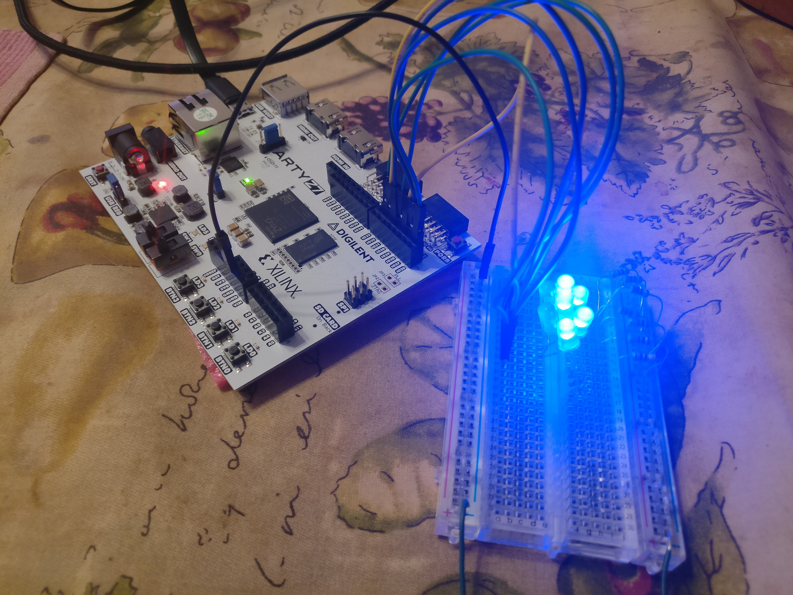
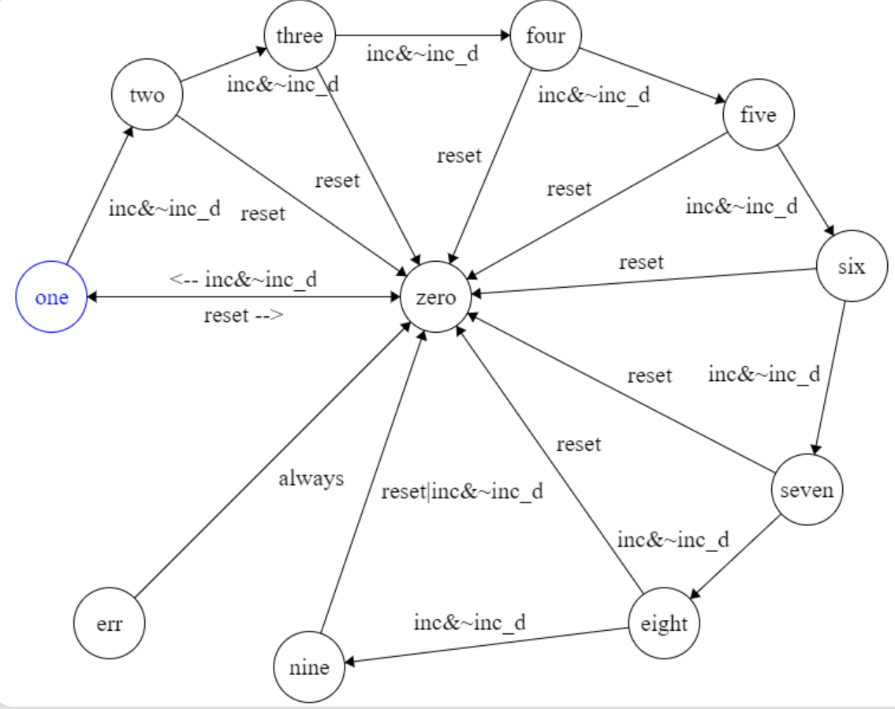

<!-- TABLE OF CONTENTS -->
## Table of Contents

* [About the Project](#about-the-project)
  * [Built With](#built-with)
* [Getting Started](#getting-started)
  * [Prerequisites](#prerequisites)
  * [Installation](#installation)
  * [Design](#design)
* [Acknowledgements](#acknowledgements)

<!-- ABOUT THE PROJECT -->
## About The Project

This is a verilog implementation of a seven segment display on the Arty Z7 development board from Diligent.

### Built With
SystemVerilog was the language used to desgin and verify the seven segment display. The Vivado webPACK was the IDE used to synthesize and compile the circuit. The development board used was the Arty Z7 by Diligent.
* [SystemVerilog](https://en.wikipedia.org/wiki/SystemVerilog#:~:text=SystemVerilog%2C%20standardized%20as%20IEEE%201800,of%20the%20same%20IEEE%20standard.)
* [Vivado webPACK](https://www.xilinx.com/products/design-tools/vivado/vivado-webpack.html)
* [Arty Z7](https://store.digilentinc.com/arty-z7-apsoc-zynq-7000-development-board-for-makers-and-hobbyists/)

<!-- GETTING STARTED -->
## Getting Started

### Prerequisites

You need:

1. Any development board with at least 2 buttons, at least 7 I/O pins, at least 1 ground pin, and an FPGA.
2. a breadboard, 7 LEDs, seven 100 ohm resisters, 9 probe cables.
3. Vivado webPACK or any IDE that will synthesize, implement and program your FPGA.

### Installation

Here's a tutorial for how to download the [Vivado webPACK](https://github.com/skyeblu7/sigARCH_Labs/blob/master/README.md)

### Design

Details:
* The display is composed of 7 LEDs each controlled by the Arty Z7's I/O pins IO0-IO6. Each LED is also in series with a 100 ohm resister.
* BTN0 is used as the increment button, so that the display iterates through the decimal numbers 0-9.
* BTN1 is used as a reset button so that the display will be forced to show 0 again, regardless of it's current displayed number.
* The logic used to control the display is a Moore state machine, one state for each number 0-9.

Circuit Schematic:

Moore Machine:

Testbentch:

<!-- ACKNOWLEDGEMENTS -->
## Acknowledgements
* [Readme Template](https://github.com/othneildrew/Best-README-Template)

